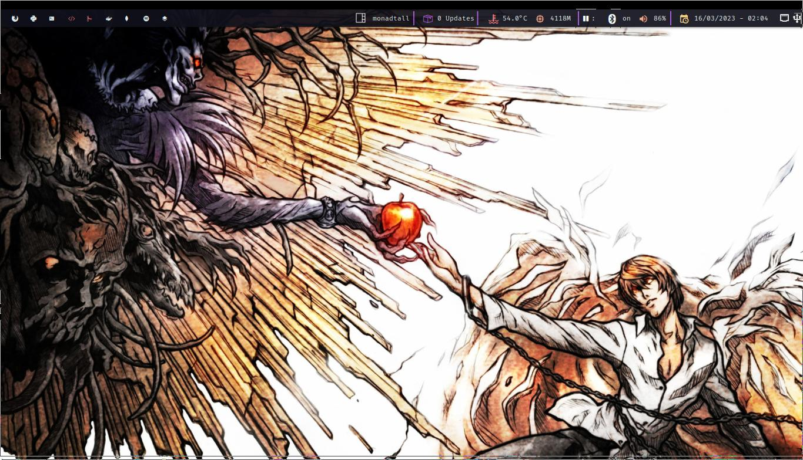
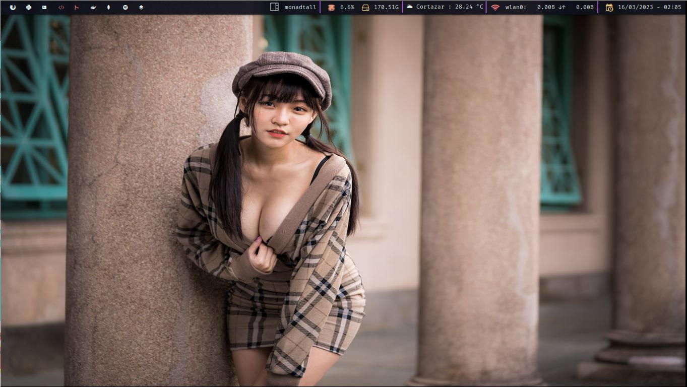

# Configuracion qtile 

Qtile es un administrador de ventana escrito en python esta configuracion esta escrita para funcionar con endevoursos qtile por lo cual recomienda instalar esa version primero y luego copiar esta configuracion.

## Estructura de carpetas 
Esta configuracion esta separada de manera modular y contien configuraciones extra para los widgets.

## Carpeta modules 
contiene la configuracion basica para qtile 

- *groups.py* : configuracion basica de los escritorios en qtile
- *hooks.py* : configuraciones de utilidad de qtile ejecutar autostart.sh
- *keys.py* : configuracion de atajos de teclado de qtile
- *layouts.py* : configuracion de distribucion de ventanas 
- *mouse.py* : configuracion del mouse en qtile
- *screens.py*: configuracion y distribucion de pantallas si tienes mas de dos monitores
- *theme.py* : cambiar el theme de quile desde el archivo config.json
- *widgets.py*: configuracion de los widgets de qtile 

## Carpeta scripts 
carpetas de utilidades para qtile 
- *spotify.py*: widget para cambiar, pausar musica de spotify para mas informaciòn revisar
[qtile-spotify-widget](https://github.com/BenGH28/qtile-spotify-widget).

- *storage.py*: configuracion para el widget de alacenamiento y mostrar el formato en GB

## Carpetas theme
Configuraciones de colores para qtile es un archivo json con diferentes paletas de colores 

## Archivo autostart.sh 
Archivo en el cual se pueden ejecutar comandos o servicios los cuales se ejecutaran al arracar qtile.

## Archivo config json 
Configurar paletas de colores de json los cuales se encuntrarn en la carpeta theme 
```json
    {"theme": "material-ocean"}
```

## Capturas de pantalla







## Enlances de ayuda
Algunos enlaces de ayuda en los que me base para hacer esta configuracion 

[antoniosarosi/dotfiles](https://github.com/antoniosarosi/dotfiles)

[endevouros](https://endeavouros.com/)

[qtile](https://docs.qtile.org/en/stable/)


